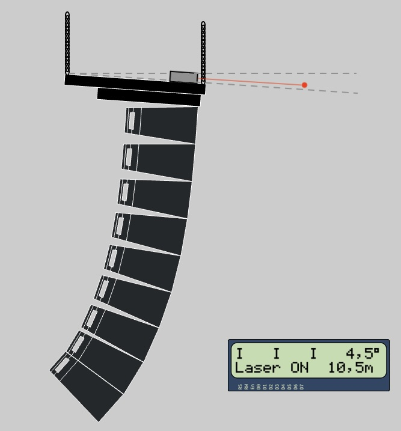

# BPC-DE2 Project

(čeština zakomentovaná ve zdrojáku README)

<h1>Arduino-Based Inclinometer for Line Array Audio Systems</h1>
<i>Brno University of Technology, Faculty of Electrical Engineering and Communication, winter semester 2024/2025</i>
<h2>Team members</h2>

Artur Nizamutdinov (Idea, documentation...) 
Nikita Kolobov (Barometr, ...) 
Jan Božejovský (Barometr, ...) 
Jakub Kováč (LCD display, documentation) 

<h2>Teoretical description, inspiration</h2>
<h3>What is an Inclinometer?</h3>

  

    An inclinometer, also known as a tilt sensor, is a device used to measure the angle of an object relative to the horizontal or vertical axis. It is commonly used in audio systems to ensure proper alignment of line arrays for optimized sound projection. Accurate angle measurements help achieve uniform sound dispersion across a venue.
      
    The inclinometer measures the angle of the line array with an accuracy of 0.1 degrees, ensuring it is perfectly aligned. A height sensor calculates how high the line array needs to be lifted to achieve the best sound coverage. To help with horizontal alignment, a laser projects a visible beam to guide the positioning. All the important information, including the tilt angle and height, is shown on a display in real time.
  

  

<h2>Hardware components</h2>

1. Arduino Uno 
The main microcontroller used to read sensor data, process it, and control the output devices. 

2. MPU6050 (Inclinometer) 
Measures the tilt angle of the line array with high accuracy. 

3. BMP280 (Height Sensor) 
Detects the elevation above the ground to ensure the line array is lifted to the correct height. 

4. Laser Module 
Projects a visible beam to indicate the direction for precise horizontal alignment. 

5. Display Module 
Shows angle and height measurments and laser status. 

<h2>Software solution</h2>

<h2>Instructions ??</h2>

<h2>Sources and references</h2>
<ol>
  <li>Microcontroller ATmega328P (<a href="https://www.microchip.com/en-us/product/ATmega328P">dokumentace</a>) on board Arduino UNO</li>
  <li>Gyroscope and accelerometer module MPU6050 for Arduino (<a href="https://components101.com/sensors/mpu6050-module">web</a>)</li>
  <li>LCD display module 16x2 (HD44780) for Arduino</li>
  <li>Materials from school course BPC-DE2: <i><a href="https://github.com/tomas-fryza/avr-course/tree/master/lab4-lcd">Lab 4: LCD (Liquid crystal display)</a></i>; <i><a href="https://github.com/tomas-fryza/avr-course/tree/master/lab6-i2c">Lab 6: I2C (Inter-Integrated Circuits)</a></i>(Tomáš Frýza)</li>
  <li>External library <i>LCD library for HD44780 based LCD's</i>, (<a href="http://www.peterfleury.epizy.com/avr-software.html?i=1">web</a>) (©2019, Peter Fleury)</li>
    <!--
  <li>Název dalších položek, popř. <a href="about:blank">link</a>...</li>
    -->
</ol> 

<!-- <h1>Název projektu</h1>
<i>Vysoké učení technické v Brně, Fakulta elektrotechniky a komunikačních technologií, zimní semestr 2024/2025</i>
<h2>Členové týmu</h2>

Artur Nizamutdinov (nápad...) 
Nikita Kolobov (...) 
Jan Božejovský (Barometr, jazyková korektura dokumentace...) 
Jakub Kováč (LCD displej, dokumentace...) 

<h2>Teoretický popis, vysvětlení</h2>

<h2>Popis hardwaru</h2>

<h2>Popis softwarového řešení</h2>

<h2>Instrukce</h2>

<h2>Zdroje a reference</h2>
<ol>
  <li>Mikrokontrolér ATmega328P (<a href="https://www.microchip.com/en-us/product/ATmega328P">dokumentace</a>) na desce Arduino UNO</li>
  <li>Modul gyroskopu a akcelerometru MPU6050 pro Arduino (<a href="https://components101.com/sensors/mpu6050-module">web</a>)</li>
  <li>Modul 16x2 LCD displej (HD44780) pro Arduino</li>
  <li>Materiály z cvičení <a href="https://github.com/tomas-fryza/avr-course/tree/master/lab4-lcd">Lab 4: LCD (Liquid crystal display)</a> (Tomáš Frýza)</li>
  <li>Knihovna <i>LCD library for HD44780 based LCD's</i>, (<a href="http://www.peterfleury.epizy.com/avr-software.html?i=1">web</a>) (©2019, Peter Fleury)</li>
  <li>Název dalších položek, popř. <a href="about:blank">link</a>...</li>
</ol>
-->
