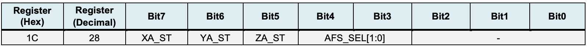
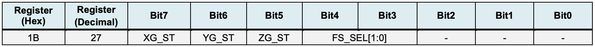
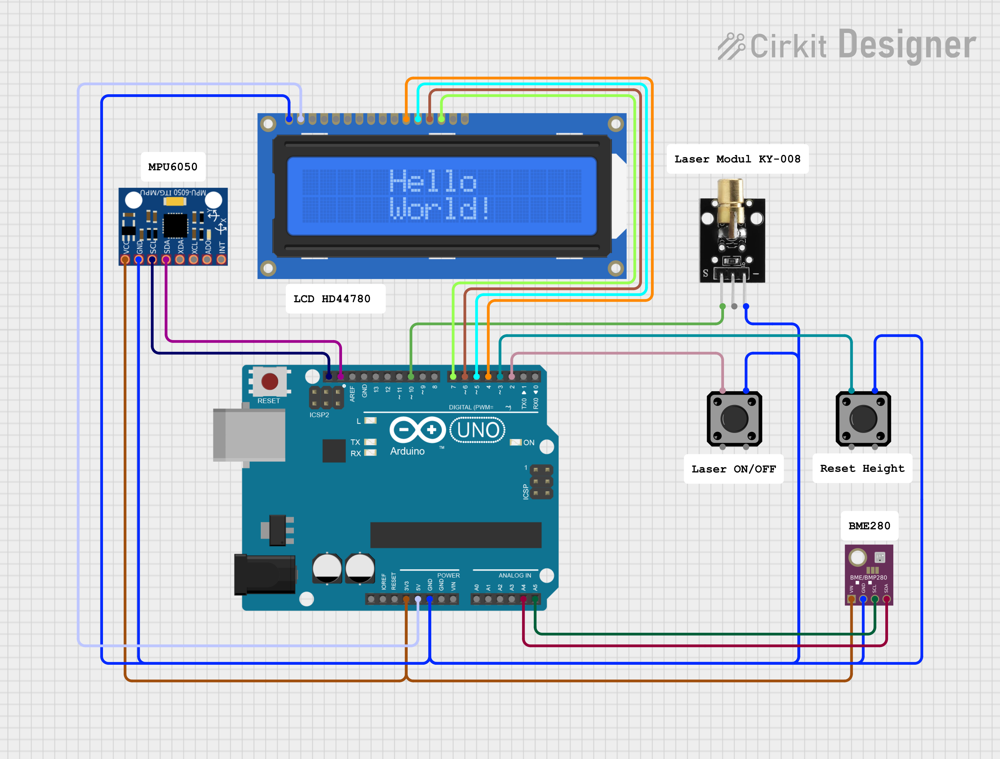

# BPC-DE2 Project

<h1>Arduino-Based Inclinometer for Line Array Audio Systems</h1>
<i>Brno University of Technology, Faculty of Electrical Engineering and Communication, winter semester 2024/2025</i>
<h2>Team members</h2>

Artur Nizamutdinov (Idea, documentation...) 
Nikita Kolobov (Barometr, ...) 
Jan Božejovský (Barometr, ...) 
Jakub Kováč (LCD display, documentation) 

<h2>Teoretical description, inspiration</h2>

### What is an Inclinometer?

  

    An inclinometer, also known as a tilt sensor, is a device used to measure the angle of an object relative to the horizontal or vertical axis. It is commonly used in audio systems to ensure proper alignment of line arrays for optimized sound projection. Accurate angle measurements help achieve uniform sound dispersion across a venue.
      
    The inclinometer measures the angle of the line array with an accuracy of 0.1 degrees, ensuring it is perfectly aligned. A height sensor calculates how high the line array needs to be lifted to achieve the best sound coverage. To help with horizontal alignment, a laser projects a visible beam to guide the positioning. All the important information, including the tilt angle and height, is shown on a display in real time.
  

  

<h2>Hardware components</h2>

### 1. Arduino Uno 
The main microcontroller used to read sensor data, process it, and control the output devices. 

### 2. MPU6050 (Inclinometer) 
A 6-axis motion tracking device with a gyroscope and accelerometer.
The gyroscope tracks angular velocity to calculate changes in angle over time, while the accelerometer detects tilt based on the device's orientation relative to gravity. A complementary filter combines both data sources to provide a stable and accurate angle measurement.  

I2C Sensor Address
- MPU6050 Address (0x68): Default I2C address for the sensor.

Registers Used
- PWR_MGMT_1 (0x6B): Used to wake up the sensor from sleep mode.
- ACCEL_CONFIG (0x1C): Configures accelerometer sensitivity.
- GYRO_CONFIG (0x1B): Configures gyroscope sensitivity.
- ACCEL_XOUT_H (0x3B): Starting address for accelerometer data (X, Y, Z).
- GYRO_XOUT_H (0x43): Starting address for gyroscope data (X, Y, Z).

#### ACCEL_CONFIG Register 0x1C

| **Binary (Bits 4-3)** | **Hexadecimal** | **AFS_SEL** | **Full-Scale Range** |
|------------------------|-----------------|-------------|----------------------|
| 00                     | 0x00           | 0           | ±2g                 |
| 01                     | 0x08           | 1           | ±4g                 |
| 10                     | 0x10           | 2           | ±8g                 |
| 11                     | 0x18           | 3           | ±16g                |

- Full-Scale Range: Measurement range of the accelerometer.

#### GYRO_CONFIG Register 0x1B

| Binary (Bits 4-3) | Hexadecimal | FS_SEL | Full-Scale Range |
|--------------------|-------------|--------|------------------|
| 00                 | 0x00        | 0      | ±250°/s         |
| 01                 | 0x08        | 1      | ±500°/s         |
| 10                 | 0x10        | 2      | ±1000°/s        |
| 11                 | 0x18        | 3      | ±2000°/s        |

- Full-Scale Range: Indicates the maximum angular velocity (in degrees per second) that the gyroscope can measure.

[MPU6050 Manual](https://invensense.tdk.com/wp-content/uploads/2015/02/MPU-6000-Register-Map1.pdf).

### 3. BMP280 (Height Sensor) 
Detects the elevation above the ground to ensure the line array is lifted to the correct height. 

### 4. Laser Module 
Projects a visible beam to indicate the direction for precise horizontal alignment. 

### 5. Display Module 
Shows angle (with graphical representation) and height measurments and laser status. 

<h2>Software solution</h2>

<h3>Showing measurments to LCD display</h3>
In this project, the HD44780 based 16x2 LCD screen is used. The first line displays the angle value between -90 and 90 degrees with a graphical representation resembling a spirit level. The second line displays the height value between -99.9 and 99.9 m. Two functions are created to display the new value - one to display the new angle and one to display the new height.
  
The numeric data is converted from a float to three integer values representing the integer part, the decimal part and the sign before displaying. It is then evaluated whether it is a positive or negative number and then whether the integer part is a two-digit or a single-digit number. The number is then displayed on the screen.
  
When the angle is displayed, the "level" is updated each time the function is called.  7 character fields have been reserved for the level display. Since the character field is 5 pixels wide, the range of -90 to 90 degrees can be represented with a step of 6 degrees. 4 custom characters (vertical bars) were created so that the position can be displayed across the entire width of the character. The display algorithm consists of calculating the position of the character according to the sign and then selecting one of the five vertical bar characters according to the interval into which the angle falls.
  

<h2>Instructions</h2>

<h2>Sources and references</h2>
<ol>
  <li>Microcontroller ATmega328P (<a href="https://www.microchip.com/en-us/product/ATmega328P">documentation</a>) on board Arduino UNO</li>
  <li>Gyroscope and accelerometer module MPU6050 for Arduino (<a href="https://invensense.tdk.com/wp-content/uploads/2015/02/MPU-6000-Datasheet1.pdf">sensor documentation</a>)</li>
  <li>Humidity sensor BME280 module for Arduino (<a href="https://www.bosch-sensortec.com/products/environmental-sensors/humidity-sensors-bme280/">sensor documentation</a>)</li>
  <li>LCD display module 16x2 (HD44780) for Arduino</li>
  <li>Materials from school course BPC-DE2: <i><a href="https://github.com/tomas-fryza/avr-course/tree/master/lab4-lcd">Lab 4: LCD (Liquid crystal display)</a></i>; <i><a href="https://github.com/tomas-fryza/avr-course/tree/master/lab6-i2c">Lab 6: I2C (Inter-Integrated Circuits)</a></i>(Tomáš Frýza)</li>
  <li>AVR-GCC libraries <i>LCD library for HD44780 based LCD's</i> and <i>UART library</i>, (<a href="http://www.peterfleury.epizy.com/avr-software.html?i=1">web</a>) (©2019, Peter Fleury)</li>
  <li> Cirkit Designer (https://app.cirkitdesigner.com/)</li>
  <li>Custom libraries <i>MPU6050.h</i> and <i>BME280.h</i></li>
    <!--
  <li>Název dalších položek, popř. <a href="about:blank">link</a>...</li>
    -->
</ol> 

<!-- <h1>Název projektu</h1>
<i>Vysoké učení technické v Brně, Fakulta elektrotechniky a komunikačních technologií, zimní semestr 2024/2025</i>
<h2>Členové týmu</h2>

Artur Nizamutdinov (nápad...) 
Nikita Kolobov (...) 
Jan Božejovský (Barometr, jazyková korektura dokumentace...) 
Jakub Kováč (LCD displej, dokumentace...) 

<h2>Teoretický popis, vysvětlení</h2>

<h2>Popis hardwaru</h2>

<h2>Popis softwarového řešení</h2>

<h2>Instrukce</h2>

<h2>Zdroje a reference</h2>
<ol>
  <li>Mikrokontrolér ATmega328P (<a href="https://www.microchip.com/en-us/product/ATmega328P">dokumentace</a>) na desce Arduino UNO</li>
  <li>Modul gyroskopu a akcelerometru MPU6050 pro Arduino (<a href="https://components101.com/sensors/mpu6050-module">web</a>)</li>
  <li>Modul 16x2 LCD displej (HD44780) pro Arduino</li>
  <li>Materiály z cvičení <a href="https://github.com/tomas-fryza/avr-course/tree/master/lab4-lcd">Lab 4: LCD (Liquid crystal display)</a> (Tomáš Frýza)</li>
  <li>Knihovna <i>LCD library for HD44780 based LCD's</i>, (<a href="http://www.peterfleury.epizy.com/avr-software.html?i=1">web</a>) (©2019, Peter Fleury)</li>
  <li>Název dalších položek, popř. <a href="about:blank">link</a>...</li>
 
</ol>
-->
