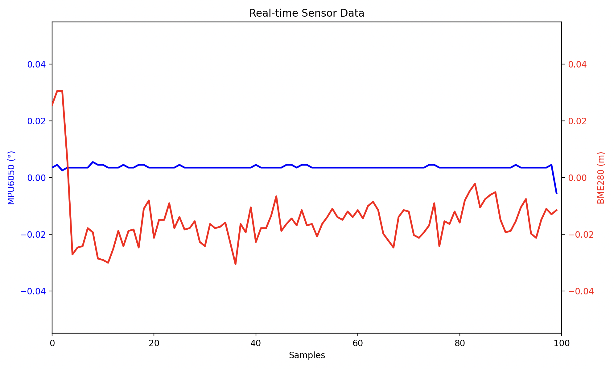

# BPC-DE2 Project

<h1>Arduino-Based Inclinometer for Line Array Audio Systems</h1>
<i>Brno University of Technology, Faculty of Electrical Engineering and Communication, winter semester 2024/2025</i>
<h2>Team members</h2>

Artur Nizamutdinov (Idea, documentation...) 
Nikita Kolobov (Barometr, ...) 
Jan Božejovský (Barometr, ...) 
Jakub Kováč (LCD display, documentation) 

<h2>Teoretical description, inspiration</h2>

### What is an Inclinometer?

  

    An inclinometer, also known as a tilt sensor, is a device used to measure the angle of an object relative to the horizontal or vertical axis. It is commonly used in audio systems to ensure proper alignment of line arrays for optimized sound projection. Accurate angle measurements help achieve uniform sound dispersion across a venue.
      
    The inclinometer measures the angle of the line array with an accuracy of 0.1 degrees, ensuring it is perfectly aligned. A height sensor calculates how high the line array needs to be lifted to achieve the best sound coverage. To help with horizontal alignment, a laser projects a visible beam to guide the positioning. All the important information, including the tilt angle and height, is shown on a display in real time.
  

  

This project draws inspiration from the [teqsas LAP-TEQ Plus](https://www.promusic.cz/teqsas-lap-teq-plus-clinometer-1109), a professional audio measurement and alignment tool.

<h2>Hardware components</h2>

### 1. Arduino Uno 
The main microcontroller used to read sensor data, process it, and control the output devices. 

### 2. MPU6050 (Inclinometer) 
A 6-axis motion tracking device with a gyroscope and accelerometer.
The gyroscope tracks angular velocity to calculate changes in angle over time, while the accelerometer detects tilt based on the device's orientation relative to gravity.  

I2C Sensor Address
- MPU6050 Address (0x68): Default I2C address for the sensor.

Registers Used
- PWR_MGMT_1 (0x6B): Used to wake up the sensor from sleep mode.
- ACCEL_CONFIG (0x1C): Configures accelerometer sensitivity.
- GYRO_CONFIG (0x1B): Configures gyroscope sensitivity.
- ACCEL_XOUT_H (0x3B): Starting address for accelerometer data (X, Y, Z).
- GYRO_XOUT_H (0x43): Starting address for gyroscope data (X, Y, Z).

#### ACCEL_CONFIG Register 0x1C

#### GYRO_CONFIG Register 0x1B

[MPU6050 Manual](https://invensense.tdk.com/wp-content/uploads/2015/02/MPU-6000-Register-Map1.pdf).

### 3. BME280 (Height Sensor) 
Detects the elevation above the ground to ensure the line array is lifted to the correct height. 

### 4. Laser Module KY-008 
Projects a visible beam to indicate the direction for precise horizontal alignment. The laser module is connected to a GPIO pin on the microcontroller. 

### 5. Display Module 
Shows angle (with graphical representation) and height measurments and laser status. 

### 6. Reset Height and ON/OFF(Laser) buttons  

<h2>Software solution</h2>

### MPU6050 

The MPU6050 initialization function sets the sensor to wake-up mode, configures the accelerometer for a sensitivity range of ±8g. The sensitivity is measured in LSB (Least Significant Bits) per g, where g is the acceleration due to gravity (9.81 m/s²). If the accelerometer is set to a full-scale range of ±8g, the sensor's sensitivity is 4096 LSB/g. This means each unit of raw data corresponds to 1/4096 of g. 

| **Binary (Bits 4:3)** | **Hexadecimal** | **AFS_SEL** | **Full-Scale Range** | **LSB Sensitivity** |
|------------------------|-----------------|-------------|-----------------------|----------------------|
| 00                     | 0x00            | 0           | ±2g                  | 16384 LSB/g          |
| 01                     | 0x08            | 1           | ±4g                  | 8192 LSB/g           |
| 10                     | 0x10            | 2           | ±8g                  | 4096 LSB/g           |
| 11                     | 0x18            | 3           | ±16g                 | 2048 LSB/g           |

Configures the accelerometer for a sensitivity range of ±8g, and the gyroscope for ±500°/s. The sensitivity is measured in LSB per degree per second (°/s). If the gyroscope is set to a full-scale range of ±500°/s, the sensor's sensitivity is 65.5 LSB/°/s. This means each unit of raw data corresponds to 1/65.5 of the angular velocity in °/s.

| **Binary (Bits 4:3)** | **Hexadecimal** | **FS_SEL** | **Full-Scale Range** | **LSB Sensitivity** |
|------------------------|-----------------|------------|----------------------|---------------------|
| 00                     | 0x00            | 0          | ±250°/s             | 131 LSB/°/s         |
| 01                     | 0x08            | 1          | ±500°/s             | 65.5 LSB/°/s        |
| 10                     | 0x10            | 2          | ±1000°/s            | 32.8 LSB/°/s        |
| 11                     | 0x18            | 3          | ±2000°/s            | 16.4 LSB/°/s        |

The data reading function communicates with the sensor over I2C to read raw accelerometer and gyroscope data from memory registers, which are then converted to physical units (g for acceleration and °/s for angular velocity). 

The calibration process averages multiple readings to calculate gyroscope offsets, eliminating bias in measurements. 
#### Gyroscope-Based Angle Calculation: 

=\varphi_0+\int_0^t\omega(t)\%20dt=\varphi_0+\omega\cdot%20t)

Using the corrected gyroscope data, the pitch and roll angles are updated by integrating the angular velocity over time (angle += gyro_value * time_interval), where time_interval corresponds to the overflow period configured by the timer in main.c. 

#### Accelerometer-Based Angle Calculation:
\cdot\frac{180}{\pi})

Pitch and roll angles are calculated using trigonometric functions (atan2). These angles represent the sensor's orientation with respect to gravity.

A complementary filter combines the angles calculated from the gyroscope and accelerometer:
- The gyroscope angle provides smooth and stable data over time but can accumulate drift.
- The accelerometer angle provides an absolute reference but is sensitive to vibrations and sudden movements.
  
The filter weights the gyroscope angle (96%) and the accelerometer angle (4%) to achieve a balance between stability and accuracy.

### BME280

The BME280 sensor used in the project is employed to calculate the altitude difference between a reference altitude value and the current position of the device based on pressure and temperature readings.
  
During initialization, the sensor must be calibrated using values stored in the sensor's memory. After storing these constants in variables named dig_T1 to dig_P9, the raw data obtained from the sensor is recalculated using these calibration constants based on the code provided in the manufacturer's datasheet. Separate conversion code is available for both temperature and pressure to obtain real values. Using the temperature and pressure values, an adjusted barometric formula is applied to calculate the altitude difference. This value is then passed as a float for further processing.
  
The sensor library also includes a function for operating a button, which allows obtaining reference values for calculating the altitude difference.
To calculate the altitude difference from the difference in atmospheric pressures, the following formula is used:

$$h = \frac{R \cdot T}{g \cdot M} \cdot \ln{\frac{p_1}{p_2}}$$

Where:
- **R = 8.314**  
   Universal gas constant, expressed in J / (mol·K).

- **T0 = 273.15**  
   Absolute zero, used to convert temperatures to Kelvin.

- **g = 9.80665**  
   Acceleration due to gravity, expressed in m / s².

- **M = 0.0289644**  
   Molar mass of air (average), expressed in kg / mol.

- **(p1, p2)**
    Atmospheric pressures at two different heights.
  

Before starting measurements, the sensor configuration (configure_bme280) involves setting the following parameters:

- Oversampling settings determine how many values will be averaged before being sent to the computation functions. This reduces noise levels in the measured data (see the table).
- Mode settings ensure the sensor exits sleep mode and starts performing measurements and sending data.
- Standby time settings specify how frequently measurement cycles should occur in the sensor.
- Filter settings control the extent to which unwanted sudden changes in pressure and temperature are suppressed. In our case we have filter coefficient  set to 16(see the table).
  

#### BME280 

#### BME280 filter mode

### Sensor Data Visualization

MPU6050 (blue line): Represents the angular tilt (in degrees) measured by the gyroscope and accelerometer.

BME280 (red line): Represents the height (in meters) calculated using atmospheric pressure readings.

Due to the constantly changing environment, we cannot calculate a stable and accurate height difference, even though we are using the average value of 250 samples.

### Laser Module KY-008

The software controls the laser module by monitoring the state of a push button, allowing the user to toggle the laser ON or OFF. A timeout mechanism ensures that the laser automatically turns off after a predefined period, with the timeout timer resetting each time the laser is activated.
The laser's status is displayed on an LCD screen.

<h3>Showing measurments to LCD display</h3>
In this project, the HD44780 based 16x2 LCD screen is used. The first line displays the angle value between -90 and 90 degrees with a graphical representation resembling a spirit level. The second line displays the height value between -99.9 and 99.9 m. Two functions are created to display the new value - one to display the new angle and one to display the new height.
  
The numeric data is converted from a float to three integer values representing the integer part, the decimal part and the sign before displaying. It is then evaluated whether it is a positive or negative number and then whether the integer part is a two-digit or a single-digit number. The number is then displayed on the screen.
  
When the angle is displayed, the "level" is updated each time the function is called. 7 character fields have been reserved for the level display. Since the character field is 5 pixels wide, the range of -90 to 90 degrees can be represented with a step of 6 degrees. 4 custom characters (vertical bars) were created so that the position can be displayed across the entire width of the character. The display algorithm consists of calculating the position of the character according to the sign and then selecting one of the five vertical bar characters according to the interval into which the angle falls.
  

<h2>Instructions</h2>

After switching on, the automatic calibration of gyroscope starts and the user waits for it to complete, which is indicated by the message "Done". The main screen is then displayed, showing an angle measurement in degrees (numerical and graphical representation), a height measurement in meters and a laser status (ON/OFF). The angle is automatically updated every 200 miliseconds and the height is automatically updated every 800 miliseconds. Pressing the Laser ON/OFF button turns the laser on and pressing it again turns it off. Once switched on, the laser will automatically switch off after a time interval of 10 seconds. The Reset Height button sets the reference level from which the height is measured. If required, the current angle and height measurements are sent to the serial output via UART.

<!--
    
  link na video...
-->

<h2>Sources and references</h2>
<ol>
  <li>Microcontroller ATmega328P (<a href="https://www.microchip.com/en-us/product/ATmega328P">documentation</a>) on board Arduino UNO</li>
  <li>Gyroscope and accelerometer module MPU6050 for Arduino (<a href="https://invensense.tdk.com/wp-content/uploads/2015/02/MPU-6000-Datasheet1.pdf">sensor documentation</a>)</li>
  <li>Build a Digital Level with MPU-6050 and Arduino (<a href="https://dronebotworkshop.com/mpu-6050-level/">web</a>)</li>
  <li>4 | How to use the MPU6050 with Arduino and Teensy (<a href="https://www.youtube.com/watch?v=yhz3bRQLvBY">video</a>) </li>
  <li>I2C Addresses and Troublesome Chips (<a href="https://learn.adafruit.com/i2c-addresses/the-list">web</a>)</li>
  <li>Build an Electronic Level with MPU-6050 and Arduino (<a href="https://www.youtube.com/watch?v=XCyRXMvVSCw">video</a>)</li>
  <li>Humidity sensor BME280 module for Arduino (<a href="https://www.bosch-sensortec.com/products/environmental-sensors/humidity-sensors-bme280/">sensor documentation</a>)</li>
  <li>LCD display module 16x2 (HD44780) for Arduino</li>
  <li>Materials from school course BPC-DE2: <i><a href="https://github.com/tomas-fryza/avr-course/tree/master/lab4-lcd">Lab 4: LCD (Liquid crystal display)</a></i>; <i><a href="https://github.com/tomas-fryza/avr-course/tree/master/lab6-i2c">Lab 6: I2C (Inter-Integrated Circuits)</a></i> (Tomáš Frýza)</li>
  <li>AVR-GCC libraries <i>LCD library for HD44780 based LCD's</i> and <i>UART library</i>. (<a href="http://www.peterfleury.epizy.com/avr-software.html?i=1">web</a>) (©2019, Peter Fleury)</li>
  <li>Cirkit Designer (<a href="https://app.cirkitdesigner.com/">web</a>)</li>
  <li>Equation Editor (<a href="https://editor.codecogs.com/">web</a>)</li>
  <li>ScreenToGif (<a href="https://www.screentogif.com/">web</a>)</li>
  <li>Custom libraries <i>MPU6050.h</i> and <i>BME280.h</i></li>
    <!--
  <li>Název dalších položek, popř. <a href="about:blank">link</a>...</li>
    -->
</ol> 
